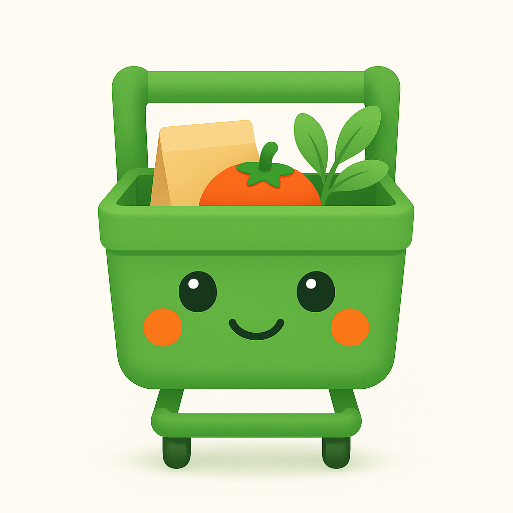

<div align="center">
  
  <h1>Smart Cart</h1>
  <p><strong>Never wonder what's for dinner again.</strong></p>
  <p>
    <a href="https://smartcart.ronanconnolly.dev">smartcart.ronanconnolly.dev</a>
  </p>
</div>

---

## What it is

Smart Cart is an AI household food planner. It learns how your household eats
(diet, allergies, taste, budget, portions), plans your week, and fills a
ready-to-order basket at Albert Heijn or Jumbo in under a minute. You just check
out.

The difference from a recipe app or a price-comparison tool: those stop at
_suggesting_. Smart Cart plans the week and builds the basket, and the whole plan
adapts when life changes. One loop that fits you better every week:

```
learn  →  plan  →  fill basket  →  cook & rate
   ▲                                    │
   └────────────────────────────────────┘
```

**Trust framing:** we never touch your money. Smart Cart plans and fills the
basket; you check out. No autonomous purchasing, by design.

## Stack

| Layer     | Choice                                             |
| --------- | -------------------------------------------------- |
| Framework | TanStack Start (SSR + server routes) on React 19   |
| Styling   | Tailwind v4 + shadcn-style components (cva)        |
| Database  | Neon Postgres via Drizzle (`neon-http` driver)     |
| Auth      | Better Auth — passwordless email OTP (Resend)      |
| Email     | Resend                                             |
| AI        | Vercel AI SDK (Anthropic primary, OpenAI / Google) |
| Host      | Cloudflare Workers (`smartcart.ronanconnolly.dev`) |

## Run it locally

```bash
pnpm install
cp .dev.vars.example .dev.vars   # then fill in the values
pnpm dev                         # http://localhost:3000
```

`.dev.vars` needs: `NEON_DATABASE_URL`, `BETTER_AUTH_SECRET`
(`openssl rand -base64 32`), `RESEND_API_KEY`, and an LLM key.

## Scripts

| Command            | Does                                                          |
| ------------------ | ------------------------------------------------------------- |
| `pnpm dev`         | Local dev server                                              |
| `pnpm quality`     | The full local gate: format + lint + typecheck + build + test |
| `pnpm db:generate` | Generate a Drizzle migration from `src/db/schema.ts`          |
| `pnpm db:migrate`  | Apply pending migrations to Neon                              |
| `pnpm deploy`      | Build + deploy the Worker                                     |

## Conventions

- **Never push to `main`.** Feature branch → PR → **squash-merge**.
- The **pre-push hook runs the full local gate** (`pnpm quality`). Green push = good.
- Commits use emoji-conventional format (`✨ feat:`, `🐛 fix:`, `📝 docs:` …),
  enforced by commitlint.
- Routes are file-based under `src/routes`. Server routes use the `server.handlers`
  option (see `src/routes/api/health.ts`).

## Layout

```
src/
  routes/            file-based routes (pages + /api/* server routes)
  components/ui/      shadcn-style primitives (button, card, input, badge)
  db/                neon client + drizzle schema (household, meal_plan, auth)
  lib/               auth (Better Auth), email (Resend), models (AI SDK), env
  styles.css         design tokens (the brand palette)
drizzle/neon/        generated SQL migrations
```

The product knowledge (vision, features, pitch, moat) lives in the
`llm-wiki-smart-cart` vault.
