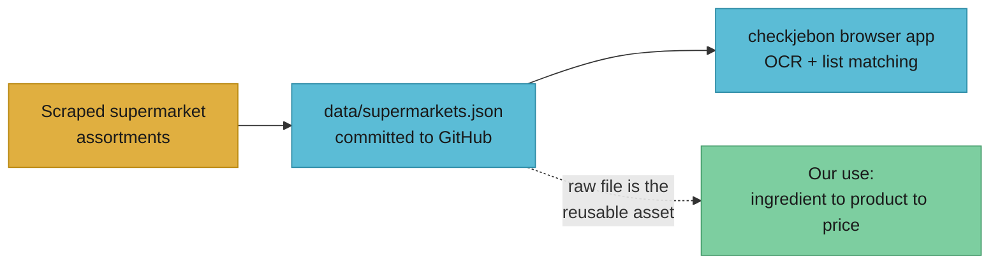
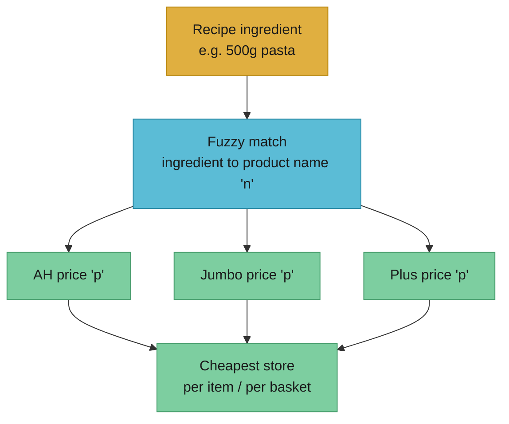

# checkjebon Dutch supermarket price/product data

This is the close-the-loop research for Smart Cart issue #45, a slice of [PRD #7 (Ordering & price)](https://github.com/RonanCodes/smart-cart/issues/7). TJ flagged [supermarkt/checkjebon](https://github.com/supermarkt/checkjebon) ("check je bon", Dutch for "check your receipt") as a possible free source of Dutch supermarket product and price data. The question this doc answers: can we use it to turn a recipe ingredient into a real store product with a real price, across multiple stores, which is the cross-store "save money" edge in the pitch?

If you only read one section, read [Verdict](#verdict).

## What checkjebon is, in one paragraph

checkjebon is a browser-only price-comparison web app. A user scans a receipt (OCR via Tesseract.js) or types a shopping list, and the page tells them how much that same list would cost at each of about twelve Dutch supermarkets ([repo README](https://github.com/supermarkt/checkjebon)). There is no backend and no server API. All matching and totalling runs client-side in the browser using `localStorage`, so a user's list never leaves their machine ([repo analysis, browser-side processing](https://github.com/supermarkt/checkjebon)). The part that matters to us is not the app: it is the single data file the app reads, `data/supermarkets.json`, which is a committed snapshot of scraped supermarket prices that the maintainer refreshes and explicitly invites others to reuse ([README: price data "may be reused in other projects"](https://raw.githubusercontent.com/supermarkt/checkjebon/main/README.md)).



The dotted line is what we care about. We ignore the app and treat the JSON file as a free, MIT-licensed price feed.

Acronyms used here: **OCR** (optical character recognition, reading text from an image), **ToS** (terms of service), **SKU** (stock keeping unit, a single sellable product variant), **EAN** (the barcode number on a product). Glossary is short enough to inline.

## What data it exposes

### Stores covered

The README lists roughly twelve supermarkets with usable online price data: **AH** (Albert Heijn), **ALDI**, **Coop**, **DekaMarkt**, **Dirk**, **Hoogvliet**, **Jan Linders**, **Jumbo**, **Picnic**, **Plus**, **SPAR**, and **Vomar** ([repo analysis](https://github.com/supermarkt/checkjebon)). It explicitly does not cover **LIDL**, **Marqt**, **Nettorama**, **Sligro** and similar chains that have no usable online assortment, and a second tier (Crisp, EkoPlaza, Flink, Makro, Odin, Poiesz and others) is "not yet indexed" ([repo analysis](https://github.com/supermarkt/checkjebon)). For Smart Cart, the load-bearing fact is that **AH and Jumbo, the two stores most likely to anchor our basket flow, are both covered.**

### Data format and fields

The data is a single committed JSON file at [`data/supermarkets.json`](https://raw.githubusercontent.com/supermarkt/checkjebon/main/data/supermarkets.json). It is a deliberately terse, short-key shape: a top-level array of supermarket objects, each with products inline.

Supermarket object:

- `n`: store identifier, for example `"ah"`
- `d`: array of product objects

Product object:

- `n`: product name, for example `"19 Crimes Chardonnay"`
- `l`: link/slug path, for example `"wi465846/19-crimes-chardonnay"`
- `p`: price as a number in euros, for example `8.99`
- `s`: pack size with unit, for example `"0,75 l"`

A concrete worked example, one store and one product, exactly as it appears in the file ([data/supermarkets.json](https://raw.githubusercontent.com/supermarkt/checkjebon/main/data/supermarkets.json)):

```json
[
  {
    "n": "ah",
    "d": [
      {
        "n": "19 Crimes Chardonnay",
        "l": "wi465846/19-crimes-chardonnay",
        "p": 8.99,
        "s": "0,75 l"
      }
    ]
  }
]
```

Note what is **not** in the file: no barcode/EAN, no category taxonomy, no nutritional data, no per-unit normalised price, no stock/availability flag, no image. The `s` size field is a free-text string with a comma decimal (`"0,75 l"`, `"500 g"`), not a parsed quantity-plus-unit pair, so any per-100g or per-litre comparison has to be parsed out by us. Each store carries on the order of a thousand-plus products ([data/supermarkets.json](https://raw.githubusercontent.com/supermarkt/checkjebon/main/data/supermarkets.json)), which is a curated common-basket set, not the full store assortment of tens of thousands of SKUs.

### How it is sourced and refreshed

The maintainer scrapes the supermarkets' online assortments. Refresh cadence is uneven: "some retailers are indexed daily, others less frequently," and a few stores are "not yet indexed on a daily basis" ([repo analysis](https://github.com/supermarkt/checkjebon); [README](https://raw.githubusercontent.com/supermarkt/checkjebon/main/README.md)). When a specific product price is missing for a store, checkjebon substitutes "a price estimate based on the average price for that product among other supermarkets" ([repo analysis](https://github.com/supermarkt/checkjebon)). That estimation is fine for the app's "rough total" use case but is a trap for us: an estimated price is not a real shelf price, and the file does not flag which prices are real versus estimated. We would be comparing partly-synthetic numbers without knowing it.

There is no published service-level guarantee, no versioned API, and no changelog. The "freshness contract" is "whenever the maintainer pushes a commit." The data lives and dies with one volunteer repo.

## License and ToS

### The repo license is clean

checkjebon is **MIT licensed**, copyright "supermarkt" 2022 ([LICENSE](https://raw.githubusercontent.com/supermarkt/checkjebon/main/LICENSE)). MIT grants permission "to deal in the Software without restriction," including use, copy, modify, and distribute, with the only condition being that the copyright and licence notice ship with substantial portions. The README reinforces this for the data specifically: the price data "may be reused in other projects" ([README](https://raw.githubusercontent.com/supermarkt/checkjebon/main/README.md)). So from the repo's own terms, **pulling `supermarkets.json` and using it in Smart Cart is permitted.** We must keep the MIT notice if we vendor the file.

### The real risk is upstream, not the repo

The licence covers checkjebon's own code and the snapshot it publishes. It cannot grant rights it does not hold over the underlying data. The prices originate from scraping AH, Jumbo, and others, and those supermarkets' own websites carry terms of service that typically prohibit automated bulk extraction. checkjebon absorbs that scraping risk on its side. If we consume checkjebon's published JSON rather than scraping the stores ourselves, we are one step removed: we are reusing an MIT-licensed dataset, not operating the scraper. That is a materially safer posture than running our own AH/Jumbo scraper, but it is not zero-risk, because the dataset is derived from data the stores assert rights over, and a price database can attract a database-right (sui generis) claim under EU law independent of copyright. For a pre-revenue pitch demo this is acceptable; before any commercial launch in NL we should get a real legal read and, ideally, move price lookups to an official or licensed source. This is an [open question](#open-questions), not a settled green light.

## How it maps to our needs

Smart Cart's promise is: take a chosen recipe, resolve each ingredient to a real purchasable product, total the basket, and show that we can do it cheaper across stores. checkjebon gives us exactly one of those layers, the price lookup, and gives it cross-store, which is the hard part to get for free.



What it gives us cleanly:

- Multi-store coverage in one file, including AH and Jumbo. Building this ourselves means scraping each store, which is the expensive, risky part.
- Real euro prices per product, free, MIT-licensed to reuse.
- Small enough to cache wholesale (single JSON file) and query in-memory or in a KV/D1 table.

Where the fit is weak, and these are the parts Nicolas owns on [#14 (product match + AH basket + price)](https://github.com/RonanCodes/smart-cart/issues/14):

- **Matching is on free-text product names only.** No barcode, no category, no canonical ingredient key. "500g pasta" to `"AH Penne 500 g"` is fuzzy string matching plus size parsing, and that is the accuracy bottleneck, not the price lookup.
- **Estimated prices are silently mixed in.** We cannot tell a real price from an averaged stand-in, so a cross-store "you save X" claim can be built on a synthetic number.
- **No basket/checkout link.** The `l` slug is an internal checkjebon path, not a store deep-link or add-to-cart endpoint. checkjebon cannot place an AH order; the actual AH basket build in #14 needs a different mechanism (AH's own flow).
- **Curated subset, not full assortment.** A real recipe ingredient may have no row at all in a given store, in which case that store drops out of the comparison.

## Integration shape

The clean pattern is pull-and-cache, never a live per-request fetch:

1. **Vendor or sync the file.** Pull `data/supermarkets.json` (keep the MIT notice). Either commit a vendored snapshot under `data/` or fetch it on a schedule (Cloudflare Cron Trigger) into KV/D1/R2. Do not fetch raw GitHub on the user's request path.
2. **Normalise once at ingest.** Expand the terse keys (`n`/`l`/`p`/`s`) into a typed product record. Parse `s` into `{ quantity, unit }`, handling the comma decimal. Build a per-store name index for fuzzy lookup. This is a derived table, regenerated each sync.
3. **Match at query time.** For each recipe ingredient, fuzzy-match against product names per store, pick best candidate, read `p`. This is the #14 work.
4. **Total and compare per store**, surface the cheapest basket. Flag low-confidence matches so a synthetic or wrong match does not silently inflate the "savings".
5. **Freshness:** treat the snapshot as days-old, not live. Show a "prices as of <date>" stamp. Re-sync on a schedule (daily is generous given uneven upstream cadence).

Gotchas to carry into #14: comma decimals in `s`; product names carrying brand/size noise that hurts matching; estimated-vs-real prices being indistinguishable; one-volunteer single point of failure; and the file growing over time, so do not assume it stays small forever.

## Alternatives if checkjebon is insufficient

If name-only matching or estimated prices prove too lossy, these are the next options, all also community projects with their own ToS exposure:

| Source                                                                               | What it adds over checkjebon                                                                                              | Trade-off                                                                                                                                         |
| ------------------------------------------------------------------------------------ | ------------------------------------------------------------------------------------------------------------------------- | ------------------------------------------------------------------------------------------------------------------------------------------------- |
| [SupermarktConnector](https://github.com/bartmachielsen/SupermarktConnector) (MIT)   | Live product search via AH and Jumbo mobile APIs; returns title, price, unit price, availability, images; search-by-query | Two stores only; we operate the API calls ourselves, so we directly carry the supermarkets' ToS risk; Python library                              |
| [open-supermarket-api](https://github.com/thijskuilman/open-supermarket-api)         | Aims at prices plus barcodes plus nutrition across AH/Jumbo (then Coop/Aldi/Plus)                                         | Very early, 4 commits, "starting phase", license unspecified; not production-ready ([repo](https://github.com/thijskuilman/open-supermarket-api)) |
| [shopscraper-api](https://github.com/wvengen/shopscraper-api)                        | Turns Dutch webshops into a queryable API                                                                                 | Scraper we host and run; same direct-ToS exposure                                                                                                 |
| [grocy-dutch-supermarket](https://github.com/PaulVerhoeven1/grocy-dutch-supermarket) | AH.nl / Jumbo.com product lookup feeding Grocy                                                                            | Aimed at self-hosted inventory, not cross-store price comparison                                                                                  |
| Official AH / Jumbo developer routes                                                 | Real, sanctioned, durable                                                                                                 | No open general price API exists today for cross-store comparison; would need partnership/licensing                                               |

The pragmatic stack: **checkjebon for the cross-store price layer in the demo, SupermarktConnector as the upgrade path** when we need live AH/Jumbo prices plus unit-price and availability for the real basket build, with the ToS read done before that step.

## Verdict

**Usable, for the demo and the pitch, as the cross-store price layer, with eyes open.** checkjebon is MIT-licensed, explicitly invites reuse, covers AH and Jumbo plus about ten more stores, and ships real euro prices in a single small JSON file we can cache. That is genuinely the cheapest way to get a multi-store price comparison on screen, which is the visible "save money" claim in the pitch. It is not a long-term production price source: prices are name-keyed (hard to match), partly estimated and unflagged, scraped from stores whose own ToS prohibit it, and dependent on one volunteer repo. The licence risk sits upstream of the repo, not in the repo, and is acceptable pre-revenue but must be revisited before a commercial NL launch.

**Concrete next step:** file a follow-up implementation slice under [PRD #7](https://github.com/RonanCodes/smart-cart/issues/7), attached to [#14 (product match + AH basket + price)](https://github.com/RonanCodes/smart-cart/issues/14), to: (1) sync-and-cache `data/supermarkets.json` (keep MIT notice), (2) normalise the terse keys and parse the `s` size field, and (3) build name-based ingredient-to-product matching with a confidence flag so estimated or weak matches never silently inflate the cross-store savings number. Keep [SupermarktConnector](https://github.com/bartmachielsen/SupermarktConnector) noted as the live-price upgrade path, pending a ToS read before any commercial use.

## Open questions

- Which checkjebon prices are real and which are averaged estimates? The file does not flag this, and a savings claim built on an estimate is misleading. Can we detect or avoid estimated rows?
- What is the actual refresh cadence per store, and how stale can a price get between commits? We see "daily for some" but no guarantee.
- Does an EU database right (sui generis) attach to checkjebon's compiled price dataset independently of its MIT licence, and does that change our reuse position? Needs a real legal read before commercial launch.
- For the real basket build in #14, what is AH's sanctioned add-to-cart / deep-link mechanism, given checkjebon's `l` slug cannot place an order?
- At what user scale does the one-volunteer single-source-of-failure risk force us onto SupermarktConnector or an official source?

## Further reading

- [supermarkt/checkjebon](https://github.com/supermarkt/checkjebon): the repo, app, and data file
- [data/supermarkets.json](https://github.com/supermarkt/checkjebon/blob/main/data/supermarkets.json): the raw price feed
- [SupermarktConnector](https://github.com/bartmachielsen/SupermarktConnector): live AH + Jumbo mobile-API connector (upgrade path)
- [open-supermarket-api](https://github.com/thijskuilman/open-supermarket-api): early open price + barcode + nutrition DB
- [List of supermarket chains in the Netherlands](https://en.wikipedia.org/wiki/List_of_supermarket_chains_in_the_Netherlands): store coverage context

## Sources

- [supermarkt/checkjebon repo and README](https://github.com/supermarkt/checkjebon)
- [checkjebon README raw](https://raw.githubusercontent.com/supermarkt/checkjebon/main/README.md)
- [checkjebon data/supermarkets.json](https://raw.githubusercontent.com/supermarkt/checkjebon/main/data/supermarkets.json)
- [checkjebon LICENSE (MIT, 2022)](https://raw.githubusercontent.com/supermarkt/checkjebon/main/LICENSE)
- [bartmachielsen/SupermarktConnector](https://github.com/bartmachielsen/SupermarktConnector)
- [thijskuilman/open-supermarket-api](https://github.com/thijskuilman/open-supermarket-api)
- [wvengen/shopscraper-api](https://github.com/wvengen/shopscraper-api)
- [PaulVerhoeven1/grocy-dutch-supermarket](https://github.com/PaulVerhoeven1/grocy-dutch-supermarket)
