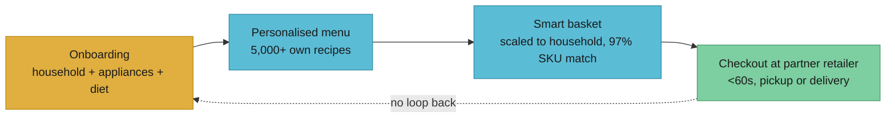
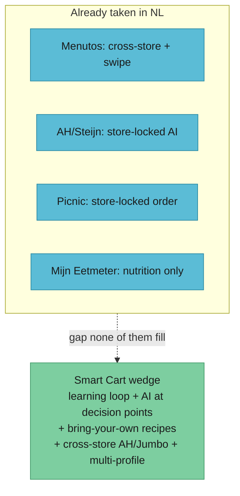

# jow.com teardown + NL competitive landscape

This is the close-the-loop research for Smart Cart issue #44. It does two things: a deep teardown of [jow.com](https://jow.fr), the French meal-plan-to-auto-basket app TJ flagged as the reference product, and a scan of the Dutch competitive landscape that Nicolas pulled together on 18 June. The point is to be precise about what these products actually do, find the ceiling each one hits, and name the wedge Smart Cart drives into the gap.

If you only read one section, read [For the pitch](#for-the-pitch).

## What jow is, in one paragraph

Jow is a free French app, launched in 2018, that picks a week of recipes for you and fills a real supermarket basket with the exact ingredients, then hands you off to checkout at a partner retailer. You set preferences once at signup (household size, kitchen appliances, dietary needs, whether there are kids), and from then on the app proposes a personalised menu and auto-populates the cart. It claims over 5 million users, 150 million meals served, partnerships with the six largest French grocers (Carrefour, Auchan, Intermarché, E.Leclerc, Monoprix, Chronodrive) reaching 4,000+ stores, and a US push into H-E-B, Kroger, Ralphs and Instacart ([jow.fr Series A note](https://jow.fr/pages/misc/frances-leading-e-recipe-and-grocery-app-jow-raises-20m-series-a-to-take-on-us-food-habits); [Sifted](https://sifted.eu/articles/jow-series-a)). It is free to the consumer and makes money on a 3-7% merchant commission per order plus retail-media sponsorships ([Jow business model breakdown](https://canvasbusinessmodel.com/blogs/how-it-works/jow-how-it-works)).

The dotted line is the whole story: the loop does not close back to learning.

## How onboarding and taste learning actually work

Jow captures taste **once, at onboarding**, not continuously. The signup flow asks for household profile, kitchen appliances, dietary preferences and whether there are children, and from that it builds a customised recipe catalogue ([Gizmodo / app listing](https://gizmodo.com/download/jow-easy-recipes-groceries); [France Today](https://francetoday.com/food-drink/french-app-jow-makes-meal-prep-and-shopping-easier/)). The recommendation engine then weighs tastes, appliances, presence of kids and ingredient availability to assemble each week's menu.

The honest read on "does it learn?": the public material describes preference capture at signup and real-time personalisation **during** recipe selection and substitution, but **no post-purchase feedback mechanism** and no closed-loop learning from what you actually bought, cooked or skipped ([Jow business model breakdown](https://canvasbusinessmodel.com/blogs/how-it-works/jow-how-it-works)). There is implicit signal (the recipes you pick week to week), and a "repeat purchases" list of staples, but there is no evidence of an explicit thumbs-up / thumbs-down loop that re-ranks the catalogue against your revealed taste over time. The strong claim Jow makes is reach and conversion speed, not adaptive learning velocity. So the calibrated answer: it personalises from a static profile and your manual picks; it does not visibly **get better at you** the more you use it.

That gap is exactly the thing our swipe-onboarding benchmark is built to win on. Our own work measures recall@20 against a household's true top-20 recipes as a function of swipe count, and the adaptive strategy reaches a usable match fastest (see [docs/benchmarks](../../benchmarks/README.md)). Jow has no equivalent published notion of "swipes to a good match" because the product is not framed as a learning problem.

## The plan to basket to checkout loop

This is Jow's genuinely strong part and the bit worth copying. The flow is: pick a weekly menu from a library of 5,000+ recipes, the algorithm scales ingredient quantities to household size and maps each item onto the chosen retailer's catalogue, then you check out. Reported numbers: **up to 70% of basket products are added by the algorithm**, SKU-mapping accuracy **above 97%**, and checkout conversion **under 60 seconds** ([Jow business model breakdown](https://canvasbusinessmodel.com/blogs/how-it-works/jow-how-it-works); [jow.fr Series A note](https://jow.fr/pages/misc/frances-leading-e-recipe-and-grocery-app-jow-raises-20m-series-a-to-take-on-us-food-habits)). Quantity optimisation to cut waste and a repeat-staples list round it out.

Where the friction is: you are locked to **one retailer per basket**. Jow maps your menu onto the catalogue of the store you picked; it does not shop the same menu across stores to find the cheaper total. So the "smart" in the cart is convenience and SKU accuracy, not cross-store price optimisation. For a Dutch user choosing between Albert Heijn and Jumbo on price, Jow's model offers nothing.

## Recipe sourcing and why it is a ceiling

Jow serves **its own recipe library** (5,000+ recipes), not the open web and not your recipes ([Jow business model breakdown](https://canvasbusinessmodel.com/blogs/how-it-works/jow-how-it-works)). This is deliberate: own recipes are how it guarantees clean ingredient-to-SKU mapping and that 97% match rate. But it is a ceiling in three ways:

1. **No bring-your-own recipes.** If your household has 20 dishes you actually cook, Jow cannot ingest them. You eat from its catalogue or you leave.
2. **Catalogue, not taste, bounds discovery.** Personalisation re-ranks a fixed library; it cannot reach the long tail of what you'd love but Jow never wrote.
3. **Curation cost scales with every new market.** Each country needs its own recipes mapped to its own retailers' SKUs, which is part of why expansion is slow and capital-heavy (the 2019 raise was explicitly to fund the recipe-and-retailer build-out; [TechCrunch](https://techcrunch.com/2019/12/09/jow/)).

## What jow does NOT do

- **No real feedback loop.** No post-purchase signal capture, no "did you cook this / would you again" that re-ranks the catalogue ([Jow business model breakdown](https://canvasbusinessmodel.com/blogs/how-it-works/jow-how-it-works)).
- **No bring-your-own recipes.** Own library only.
- **No cross-store price optimisation.** One retailer per basket; convenience over savings.
- **No standalone learning AI as the headline.** The headline is reach, conversion speed and SKU accuracy, not an engine that compounds on your behaviour.

## Pricing, market, and why it will not come to NL

Free to the consumer, no subscription; revenue is ~3-7% merchant commission (~60% of 2025 revenue), retail-media sponsorships (~30%) and B2B APIs (~10%) ([Jow business model breakdown](https://canvasbusinessmodel.com/blogs/how-it-works/jow-how-it-works)). Funding: a $7M round in 2019 ([TechCrunch](https://techcrunch.com/2019/12/09/jow/)) and a $20M Series A to expand to the US ([jow.fr](https://jow.fr/pages/misc/frances-leading-e-recipe-and-grocery-app-jow-raises-20m-series-a-to-take-on-us-food-habits)).

Why NL is unlikely to be next:

- **The model is retailer-deal-gated.** Jow only works where it has signed catalogue integrations with the dominant grocers. Entering NL means landing deals with Albert Heijn and Jumbo, who already run their own in-app meal planning (Steijn, below), so there is little incentive for them to feed a third party a 3-7% commission.
- **Strategic focus is the US**, the market the Series A was raised for, not a second small European market.
- **The recipe-and-SKU build per country is expensive** and NL is a fraction of the US prize.

The opening this leaves: NL has no free, cross-store, learning meal-planner. The incumbents are either store-locked (AH, Picnic) or do not plan-and-shop at all (the price-comparers, the nutrition apps).

## NL competitive landscape

| Product                             | What it does                                                                                                  | Cross-store?        | Learns taste over time? | Nutrition?      | Price                       |
| ----------------------------------- | ------------------------------------------------------------------------------------------------------------- | ------------------- | ----------------------- | --------------- | --------------------------- |
| **Menutos**                         | Weekly meal planning, swipe discovery ("Swipe. Match. Eat."), auto shopping list, price-compares supermarkets | Yes (price-compare) | No                      | No              | Free                        |
| **AH App / Steijn**                 | Conversational AI assistant over 20,000+ AH recipes, fridge-photo suggestions, weekly menu                    | No (AH only)        | Partial (AH-locked)     | Some tips       | Free (AH)                   |
| **Picnic**                          | Own online supermarket, recipe-to-order for families, free delivery                                           | No (own store)      | No                      | No              | Free delivery               |
| **Miiro**                           | General AI household assistant ("Sam"), groceries + meal plans in plain language                              | No                  | Partial (general)       | No              | Subscription (~EUR 9.99/mo) |
| **Voedingscentrum / Mijn Eetmeter** | Diet diary, 150,000-product DB, barcode scan, macro/micro analysis                                            | No                  | No                      | Yes (only this) | Free                        |

### Menutos (the closest competitor, differentiate hardest here)

Menutos is the nearest thing to us in NL: free, swipe-based recipe discovery (its own tagline is "Swipe. Match. Eat." on the [App Store listing](https://apps.apple.com/nl/app/menutos/id6502402429)), weekly meal planning, auto-generated and shareable shopping lists, and supermarket price comparison ([Google Play](https://play.google.com/store/apps/details?id=nl.menutos.app)). Per Nicolas's 18 June research it price-compares 18 supermarkets across 1,400+ recipes. What it does **not** have: no AI that learns your taste over time (swipe seeds discovery but does not compound into a model), and no nutrition. So Menutos already owns "free + cross-store + swipe discovery" in NL. Our differentiation against Menutos is specifically the **learning feedback loop**, **AI at decision points**, **bring-your-own recipes**, and **family multi-profile**, none of which it does.

### AH App / Steijn

Steijn is Albert Heijn's AI assistant inside the Mijn AH app: chat-based, access to 20,000+ AH recipes and nutrition tips, suggests recipes from a photo of your fridge, runs a personal weekly menu, handled 1M+ interactions across 5M+ app users ([Microsoft Source EMEA](https://news.microsoft.com/source/emea/features/steijn-the-ai-assistant-transforming-meal-planning-for-millions-in-the-netherlands/)). It is genuinely capable, but **AH-locked**: every recipe, price and basket is Albert Heijn. It cannot tell you Jumbo is cheaper this week, by design.

### Picnic

Picnic is an own-store online supermarket (no physical shops, free delivery, ~1M customers across NL/FR/DE) with hundreds of family recipes you can add-to-order in one tap ([Picnic on Google Play](https://play.google.com/store/apps/details?id=com.picnic.android)). Same lock-in as AH: recipe-to-order, but only Picnic's catalogue and Picnic's prices. No comparison, no taste learning.

### Miiro

Miiro is a broader AI household assistant ("Sam") for couples and families that handles groceries, meal plans and chores from plain-language requests, on a paid household subscription ([miiro.app](https://miiro.app/)). It is general-purpose rather than a focused grocery optimiser; meal planning is one of many jobs, not the spine, and it is not cross-store price-optimised.

### Voedingscentrum / Mijn Eetmeter

The government-funded Dutch nutrition diary: 150,000-product database, barcode scanning, macro and micronutrient breakdown against the Schijf van Vijf, 2.5M+ downloads, free forever ([Voedingscentrum](https://www.voedingscentrum.nl/nl/thema/apps-en-tools-voedingscentrum/mijn-eetmeter-app-online.aspx)). It is **nutrition only**: no planning, no shopping, no recipes-to-basket. It owns the trusted-nutrition slot that none of the planners credibly fill.

## Our wedge

No single NL product does all of: a **real learning feedback loop**, **AI at the decision points**, **bring-your-own recipes**, **cross-store price optimisation**, **family multi-profile**, and **nutrition awareness**. The map:

- Menutos has cross-store + swipe, but no learning, no nutrition, no own-recipes.
- AH/Steijn has AI + nutrition tips, but is single-store by construction.
- Picnic has frictionless recipe-to-order, but is single-store and does not learn.
- Miiro has conversational AI, but no cross-store optimisation and meal-planning is a side job.
- Mijn Eetmeter has trusted nutrition, but no planning or shopping.

Smart Cart's wedge is the **intersection nobody occupies**: a learning loop that compounds on your actual swipes and purchases, AI that intervenes where the decision is (swap, scale, substitute, optimise basket), recipes you bring as well as discover, true cross-store optimisation across AH and Jumbo, and family multi-profile.

## What we copy vs what we do differently

| Dimension       | Copy from jow                                                                                                    | Do differently                                                                                                                                                  |
| --------------- | ---------------------------------------------------------------------------------------------------------------- | --------------------------------------------------------------------------------------------------------------------------------------------------------------- |
| Plan to basket  | The full menu-to-auto-basket flow, quantity scaling to household, sub-60s checkout feel, high SKU-match accuracy | Shop the same menu **across AH and Jumbo** and surface the cheaper total, not one locked retailer                                                               |
| Recipes         | A curated own-library for clean SKU mapping as the base                                                          | Add **bring-your-own recipes** on top so the household's real dishes are first-class                                                                            |
| Personalisation | Capture household + appliances + diet at onboarding                                                              | A **closing feedback loop**: swipes and purchases re-rank the catalogue so it measurably improves week over week (our recall@20 benchmark is the proof harness) |
| AI              | Algorithmic basket assembly                                                                                      | **AI at decision points**: swap-for-similar, smart substitutions, budget-aware basket trimming                                                                  |
| Profiles        | Household size scaling                                                                                           | **Multiple taste profiles per family**, not one blended household                                                                                               |
| Monetisation    | Free to consumer, merchant-side economics                                                                        | Keep consumer-free; do not get gated behind a single retailer's commission deal                                                                                 |

## For the pitch

- **Jow plans and shops but never learns.** It personalises from a profile you set once; it has no post-purchase feedback loop. Smart Cart closes the loop so every swipe and purchase makes the next week's plan better.
- **Every NL incumbent is locked to one store or does not shop at all.** AH/Steijn and Picnic are single-store by design; the price-comparers do not plan; the nutrition apps do not buy. We are the only one that plans, learns, and shops cross-store across AH and Jumbo.
- **Menutos is the one to beat, and it stops at swipe.** Free, cross-store, swipe discovery, but no learning, no nutrition, no bring-your-own recipes. We take its strengths and add the loop it does not have.
- **We occupy the intersection nobody holds:** a learning feedback loop, AI at the decision points, bring-your-own recipes, cross-store optimisation, and family multi-profile, together.

## Open questions

- What is the real Albert Heijn / Jumbo catalogue integration path for a third party, and is it API, scrape, or affiliate? This gates cross-store from a plan, not a slide.
- How many swipes does our adaptive recommender need in practice (not synthetic) to beat a cold Menutos session? The benchmark says it wins on synthetic users; we need a real-household check.
- Does Menutos have any retention/learning signal we are underrating (e.g. implicit re-ranking from saved favourites)?
- Is "bring-your-own recipes with clean SKU mapping" tractable, or does the long tail of free-web recipes blow up the 97%-match assumption Jow protects by staying closed?
- Nutrition: do we fold in a Mijn Eetmeter-style awareness layer, or stay out of the trusted-nutrition lane the Voedingscentrum owns?

## Sources

- Jow business model and mechanics: https://canvasbusinessmodel.com/blogs/how-it-works/jow-how-it-works
- Jow Series A and US expansion: https://jow.fr/pages/misc/frances-leading-e-recipe-and-grocery-app-jow-raises-20m-series-a-to-take-on-us-food-habits
- Jow Series A coverage: https://sifted.eu/articles/jow-series-a
- Jow 2019 funding: https://techcrunch.com/2019/12/09/jow/
- Jow app onboarding and stores: https://gizmodo.com/download/jow-easy-recipes-groceries , https://francetoday.com/food-drink/french-app-jow-makes-meal-prep-and-shopping-easier/
- Menutos: https://play.google.com/store/apps/details?id=nl.menutos.app , https://apps.apple.com/nl/app/menutos/id6502402429
- AH Steijn: https://news.microsoft.com/source/emea/features/steijn-the-ai-assistant-transforming-meal-planning-for-millions-in-the-netherlands/
- Picnic: https://play.google.com/store/apps/details?id=com.picnic.android
- Miiro: https://miiro.app/
- Voedingscentrum Mijn Eetmeter: https://www.voedingscentrum.nl/nl/thema/apps-en-tools-voedingscentrum/mijn-eetmeter-app-online.aspx
- Canonical Smart Cart plan: `vaults/llm-wiki-smart-cart/wiki/megathon-team-plan-2026-06-19.md`
